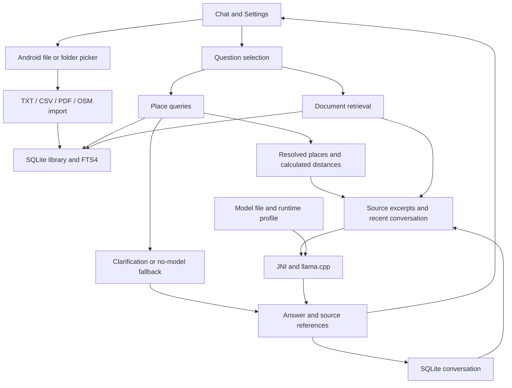

# Architecture

Outpost has one Android process and two main functions: knowledge retrieval and local inference. The process contains the user interface, SQLite databases and native model session. Google Play Services are not necessary for core operation. The app has no inference server, cloud fallback or tool executor.

Preparation can use external downloads. After preparation, inference, retrieval, indexing and source display use local files.

## Components

Java files are in [app/src/main/java/dev/outpost/app](../app/src/main/java/dev/outpost/app). Native files are in [app/src/main/cpp](../app/src/main/cpp).

| Component | Function |
|---|---|
| `MainActivity` | Chat, Settings, file selection, source display and lifecycle control |
| `ChatStore` / `ChatPrompt` | Conversation storage and prompt preparation |
| `DocumentImporter` / `FolderImporter` | Import identity, limits, folder traversal and cancellation |
| `Library` / `Evidence` | Database changes, retrieval, document packs and source locators |
| `CsvTable` / `PdfImporter` | CSV records and PDF text with page identity |
| `OsmImporter` / `OsmStorage` / `PlaceQueries` | OSM parsing, feature storage and place queries |
| `ModelStore` / `RuntimeSettings` | Model identity checks and runtime configuration |
| `NativeEngine` / `engine.cpp` | JNI, requests, model state, sampling and cache control |
| `cpu_caps.c` / `q2_dispatch.c` | CPU detection and kernel selection |
| `q2_kernel.c` / `q2_batch.c` / `q2_arm.c` | Q2 vector/matrix calculations and the original reference path |
| `attention_probe.cpp` | Attention-worker control and research probes |

`speculation.cpp`, `ResearchPrompt`, `JudgeStore` and `EvidenceReview` are for research and evaluation. The product has no reviewer or speculation controls. Release builds exclude the Kev head and configuration. They expose only the seven JNI functions in [release.exports](../app/src/main/cpp/release.exports).

## Answer flow

### Place questions

`Library.answerPlaces` uses stored names, categories and the stated landmark or radius. Street and address questions resolve the same named feature. It detects ambiguous names and conflicting IDs. It calculates approximate straight-line distances. It returns a maximum of five results with source references.

When a model is ready, `ChatPrompt.preparePlaces` supplies the resolved places, calculated distances and selected recorded tags. The prompt labels reference places, result places, recorded types and street fields. Missing streets remain explicit unknown values.

The model writes an answer with the same source references. List answers describe up to three results. Single-place answers use a short paragraph. The saved source list retains all returned records.

Unresolved queries, conflicting snapshots and missing models keep the direct database response. This path does not give GPS position, current conditions, routes or polygon containment. Model wording can be incorrect. Source review remains necessary.

### Model preparation

Settings offers source download and local-file import for each supported model. Source URLs specify a Hugging Face repository, immutable revision and filename. Download opens the system browser. Outpost does not add network permission or download in the background. The user imports the completed file with the system file picker. 

Model import compares size and SHA256 before activation. An alternative download source must provide the same specified bytes.

### Other questions

FTS retrieves passages for the question. If the first search gives no result, another search can include the previous user question.

`ChatPrompt` considers the last two completed or length-limited turns. Independent document questions omit unrelated turns. Follow-ups, shared topics and explicit ongoing preferences retain bounded context. This selection uses text rules and can misclassify context. The prompt also includes a maximum of three source excerpts related to the question.

Later prompts exclude failed, canceled and interrupted output. The prompt treats source text as data. It replaces role delimiters in source text with literal text.

Before inference, the app saves a pending turn and its source locators. `RuntimeSettings.Profile.configuration(...)` gives the native request its configuration. The app shows completed output tokens as they become available. It then saves the answer, references and completion state.

If retrieval finds no document, the model can use general knowledge. The prompt gives instructions against invented personal records and current conditions. This instruction does not guarantee a correct answer.

| Setting | Value |
|---|---|
| Context | 2,048 tokens |
| Output | 192 tokens or fewer |
| Request deadline | 120 seconds |
| Bonsai sampling | top-k 20; top-p 0.8; temperature 0.7; seed 42 |
| Qwen sampling | Greedy |
| Production speculation depth | Zero |

## Data storage

| Store | Contents |
|---|---|
| `library.db`, schema 5 | Documents, FTS4 passages, import origins, versioned packs and OSM features |
| `chat.db`, schema 1 | Questions, answers, source locators and turn states |
| `files/documents` | Private PDF and OSM originals |
| `files/models` | GGUF files and verification markers |
| App preferences | Draft, selected model, import state and runtime settings |

The initial product library is empty. Test APKs contain the example knowledge and test providers.

Import identity includes the source URI, format and original-byte hash. An unchanged file does not make another document if the app already has its saved copy. Changed bytes make a new snapshot. Older snapshots are still searchable.

Knowledge packs use atomic activation. An older pack version stays available for its existing locators but leaves normal search results. A source locator contains document identity, revision, source kind, ordinal and content hash. A removed source must not silently resolve to another document.

Each folder file has a separate commit. OSM document, feature, FTS and origin rows have one SQLite transaction. OSM features use separate rows, not one large document body. File copies and SQLite transactions are not one crash-atomic operation. Complete orphan-file recovery is not available.

## Execution and cache control

Library work and inference use separate single-thread executors. During generation, the app blocks import and model changes. During a folder import, the app blocks message sending. The user can still change a draft. Provider calls and parser startup can delay cancellation.

Each native session has a lock. A global `execution_mutex` also controls graph execution because kernel settings are process-wide. Kernel configuration must be inside this execution boundary. Persistent thread pools pause between requests.

When the app moves to the background, it stops generation and schedules cache removal. Activity destruction also stops folder work. A low-memory request does not keep its context for reuse.

The runtime can reuse compatible token prefixes and saved prefix logits. Changes to the model, template, context or kernel policy must remove incompatible cache state. `NativeEngine.Configuration` has 15 fields. These include attention and matrix settings. Older constructors can omit these fields.

## Pixel runtime profile

The accepted Pixel/Bonsai 4B profile has these values:

| Setting | Value |
|---|---|
| Decode workers / prefill workers | 6 / 6 |
| Logical attention workers | 4 |
| Batch / width | 128 / 8 |
| Prefill row group / decode row group | 1 / 4 |
| Prefill chunk / decode chunk | 32 / 0 |
| Thread pools / affinity | Persistent / none |
| Matrix kernel policy | I8MM policy 1 |

For `attentionThreads=4`, six decode workers, six prefill workers and zero speculation are necessary. That attention setting and available I8MM code are also necessary for `matrixKernel=1`. CPU support alone is not sufficient. [RuntimeSettings.java](../app/src/main/java/dev/outpost/app/RuntimeSettings.java) gives the exact fingerprint and capability conditions. Other profiles use conservative settings.

ARM I8MM processes eligible matrices with more than one column. Single-column work uses DotProd. Q2_0 g64 storage uses 2.25 effective bits per weight, including scales. Its prepared activations use Q8. The kernels keep the original lane groups and accumulation order. KV storage uses F16.

The attention wrapper depends on the specified backend barrier and scratch-memory behavior. New numeric and concurrency tests are necessary after a backend change.

## Resource goals and extensions

The device goal is a maximum of 12 GB installed RAM. The storage goal is 50 GB for the complete offline setup. This total includes the app, models, originals, indexes, databases, caches and temporary copies.

Model file size is not sufficient evidence for these limits. Live model state, KV cache, activation workspace, parsers and the OS also use memory. Per-file import limits exist. There is no global storage cap. Current physical measurements use a 16 GB Pixel.

The manifest requests no permissions and disables backup. Imports make private copies. Sources cannot run code, operate device tools or give permission for external actions. The app has no account, telemetry, downloader or synchronization service.

New data adapters must have parser limits, source identity and resolvable references. File, template and runtime checks are necessary for new models. CPU, compiled-code, shape and numerical checks are necessary for new kernels. OCR, Office/ZIM, trained MTP/Engram and equipment actions are not available. The [test guide](testing.md) lists the remaining acceptance work.

## Large knowledge packs: research direction

Preparation downloads will use an explicit user action. The app will operate with or without a network connection. Offline tests enable airplane mode after installation, model preparation and data preparation. The product does not require a connectivity check or an airplane-mode gate. RC2 still has no downloader or network permission.

The [pack review](../evidence/research/pack-options-20261007/review.json) compares four storage and retrieval options. The [catalog snapshot](../evidence/research/pack-options-20261007/catalog-snapshot.json) records exact publisher file sizes. These are research findings, not supported product formats.

| Candidate | Proposed use | Necessary validation |
|---|---|---|
| ZIM with libzim/Xapian | Prepared encyclopedia and travel snapshots | Android reader, text extraction, references and memory |
| Native SQLite FTS5 | Custom packs and user records | Ranking, compressed content, cancellation and storage |
| Leviathan library | Records grouped by equipment or another entity | Android integration, scope, filters and complete evidence |
| Tantivy | Larger custom indexes if another engine reaches a measured limit | Android integration, segments, memory and equal-corpus performance |

The provisional design uses separate readers behind a common retrieval interface. Results must identify the pack, content hash, entry and passage. Source display must resolve the exact stored version.

OSM region packs need spatial filtering before distance calculations. The current place query scans at most 20,000 records. Lexical ranking alone does not replace a spatial index.

The installed storage budget must count content, indexes, model weights, originals, caches, partial downloads and update copies. File sizes in GB use decimal bytes. The initial conservative total limit is 50,000,000,000 bytes.

## Technical terms

These terms have the meanings below in Outpost documentation. Product names, code symbols, file paths and interface labels keep their exact spelling.

| Technical noun | Meaning |
|---|---|
| ABI | Binary interface for a processor architecture |
| APK / AAB | Android application package / Android App Bundle |
| Backend | The model computation code supplied by llama.cpp |
| Build receipt | A record of source and output file identities for one build |
| Decode | The operation that generates answer tokens |
| Fallback | The original calculation path used when a faster kernel is not eligible |
| Fixture | Specified test input and expected results |
| GGUF | The model file format used by this app |
| Inference | Model calculations that give output from an input prompt |
| JNI | Java Native Interface, between Java and native code |
| Kernel | A program for a specified numerical operation |
| KV cache | Stored attention keys and values for previous tokens |
| Logits | Model scores for possible next tokens, before sampling |
| Prefill | The operation that processes prompt tokens and prepares the KV cache |
| Quantization | Numerical encoding that uses fewer bits for model values |
| Pack reader | Component that searches one stored knowledge format and resolves its sources |
| FTS5 / BM25 | SQLite full-text extension and its relevance scoring function |
| ZIM | Compressed archive format for offline content |
| Spatial index | Structure that selects records by coordinate bounds |
| Runtime profile | Settings for a specified device, OS, app version and model |
| Snapshot | A saved version of imported source bytes |
| Source locator | Data that identifies an exact saved source fragment |
| Thread pool | Workers that the runtime can use for more than one request |

The technical verbs below apply only to the specified software operations.

| Technical verb | Meaning |
|---|---|
| Build | Make application files from source code and dependencies |
| Compile | Make a program from source code |
| Enter | Put text into a user interface field |
| Generate | Calculate new output with the model or another program |
| Run | Operate a program or test procedure |
| Reuse | Use existing compatible data or workers for another software operation |
| Download / upload | Transfer a file from / to another computer |
| Import / export | Transfer data into / out of the app's defined data format or storage |
| Hash | Calculate a file digest with the specified hash algorithm |
| Parse | Read data according to its defined syntax |
| Rebuild | Compile the specified source again |
| Sign | Apply a digital signature with the selected key |
