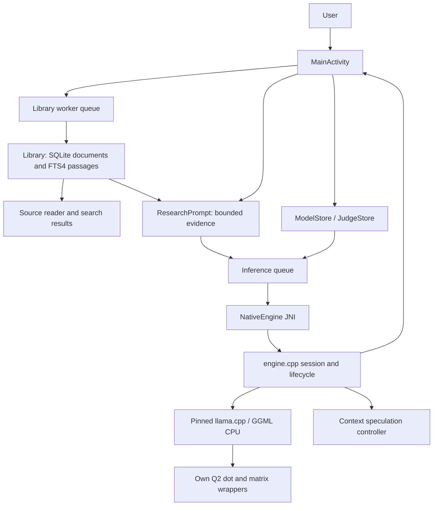
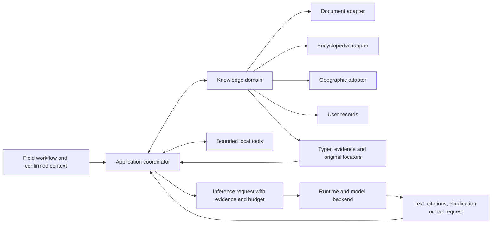

# Architecture

Status: current implementation plus explicitly proposed module boundaries. Current code: Outpost 0.11.0. The product opens on chat; see [current flow](chat-beta.md). The rename and English baseline preserve the 0.7 runtime architecture.

## Current application

One Android application process owns the UI, SQLite library, and native inference session. There is no HTTP inference service and no host-side model execution.

### Source map

All Java paths below are under `app/src/main/java/dev/outpost/app/`; all native paths are under `app/src/main/cpp/`.

| File | Responsibility |
|---|---|
| [MainActivity.java](../app/src/main/java/dev/outpost/app/MainActivity.java) | UI, document/model selection, worker queues, streaming, lifecycle and memory callbacks |
| [Library.java](../app/src/main/java/dev/outpost/app/Library.java) | Schema-3 database/migration, active package versions, imported documents, chunking, lexical retrieval and exact source resolution |
| `Evidence.java`, `CsvTable.java`, `KnowledgePack.java` | Typed locators, bounded CSV parsing and versioned JSON pack validation |
| [ResearchPrompt.java](../app/src/main/java/dev/outpost/app/ResearchPrompt.java) | Select up to three passages, bound prompt text, sanitize role delimiters, inspect numeric citations |
| [ModelStore.java](../app/src/main/java/dev/outpost/app/ModelStore.java) / [JudgeStore.java](../app/src/main/java/dev/outpost/app/JudgeStore.java) | Locked model identity, file import/verification, private model storage |
| [RuntimeSettings.java](../app/src/main/java/dev/outpost/app/RuntimeSettings.java) | Persist measured runtime settings and the speculation preference |
| [NativeEngine.java](../app/src/main/java/dev/outpost/app/NativeEngine.java) | JNI interface, request IDs, cancellation, configuration, results and callbacks |
| [EvidenceReview.java](../app/src/main/java/dev/outpost/app/EvidenceReview.java) | Bounded first-sentence review input and model-choice labels |
| [engine.cpp](../app/src/main/cpp/engine.cpp) | Session/model/context lifetime, prompt evaluation, sampling, cache, verification, Kev execution |
| [cpu_caps.c](../app/src/main/cpp/cpu_caps.c) / [q2_dispatch.c](../app/src/main/cpp/q2_dispatch.c) | CPU/OS capabilities and supported implementation selection |
| [q2_kernel.c](../app/src/main/cpp/q2_kernel.c) / [q2_batch.c](../app/src/main/cpp/q2_batch.c) | Custom Q2 g64 dot product and grouped matrix operations |
| [speculation.cpp](../app/src/main/cpp/speculation.cpp) | Same-request token proposals, verification helpers, adaptive cost controller |
| [CMakeLists.txt](../app/src/main/cpp/CMakeLists.txt) | Pinned dependency integration, conservative CPU baseline, linker wrappers |

### Request flow

1. `Library.search()` bounds the question to 1,000 characters and at most 20 normalized terms. It reads at most 500 FTS candidates, ranks them, and returns at most eight passages. Full document bodies are loaded only for selected results and reused per document.
2. `ResearchPrompt.prepare()` takes up to three hits. Titles are bounded to 140 characters, passages to 850, and the question to 600. These are character limits, not a guarantee of token fit; native context validation remains necessary.
3. The UI resolves the selected model and its device-specific runtime profile, sets a new request ID, and submits inference on its separate queue. The evidence-only research path stops on no hits. Product chat uses `ChatPrompt` and may answer from model knowledge without fabricated source claims.
4. JNI serializes graph execution, selects or loads the model, configures the context, prepares tokens, and reuses only compatible cached prefixes.
5. The engine emits confirmed text through a callback. Cancellation, deadline, token budget, and EOS bound the request.
6. The UI checks citation indices against the supplied passages and keeps those passages inspectable. Optional Kev review is another inference operation that switches the session's loaded model.

### Concurrency and state

The library worker and inference worker are separate single-thread executors. Search and reading need not wait for generation. Native sessions use a per-session lock; a global `execution_mutex` serializes graph work because kernel configuration is shared within the process. Worker kernel settings must not change during a graph.

Weights, tokenized prompt prefixes, KV state, and saved final-prompt logits have different lifetimes. Clearing a prompt context is not equivalent to deleting the model file. Backgrounding or the applicable memory callback cancels work and schedules cache release. Android's low-memory flag disables retaining the context for the current request. See [runtime](inference-runtime.md) for exact cache semantics.

## Intended architecture

The two-domain separation is an adopted direction, but there are no separate Gradle modules or fully implemented interfaces for it yet. Refactor through working vertical slices instead of a large module rewrite.

The knowledge domain owns content, indexes, versions, provenance, and retrieval. Inference owns model/runtime lifecycle and bounded generation. The coordinator owns the user's confirmed context, tool allowlist, evidence selection, and answer presentation. Sources and model output cannot independently authorize tools.

Changing a generator should not rebuild a knowledge package. Changing an embedding encoder may require rebuilding its own index. Reading a manual page or calculating a difference should remain possible without generation.

## Proposed context and action extensions

The [discovery note](discovery-2026-09-29.md) proposes personal-file context, a simulated equipment adapter, and a future action ledger under the application coordinator. These extend the application layer while preserving inference and knowledge as the two core domains. No transport, scheduler, connector, or new permission is implemented by this proposal.

Track internet reachability, local-device reachability, available documents, and location freshness independently. Document-answer mode still requires evidence; a potential reflection mode would use an explicit different context/retention contract. A device adapter returns typed observations and exposes only known procedures with applicability checks. A persistent queue binds each future action to an exact destination/payload and an explicit authorization scope; network recovery alone cannot authorize it.

The current no-INTERNET manifest remains unchanged. Any IP or remote executor needs a separate design decision about component boundaries, permissions, delivery semantics, and user expectations. Emulator fake transports/services are the only initial execution candidates.

## Data and failure boundaries

Database schema 4 stores source metadata, document revisions and active/retained package versions alongside FTS4 fragments. The transactional schema-1 upgrade preserves imported IDs/content and rolls back failed alterations. CSV fragments retain record/header relationships; exact locators resolve archived source versions. Pack activation is atomic. See [knowledge-pack v1](knowledge-packs-v1.md). Persistent mission state, structured geographic entities and local tools remain proposed.

Proposed request failures should distinguish `no_coverage`, `no_relevant_evidence`, `missing_context`, `unsupported_capability`, `cancelled`, `deadline`, and `resource_limit`. These are design categories, not existing public error enums. A missing package must not silently trigger unsupported model-memory claims or a network fallback.

The [knowledge contract](knowledge-base.md), [decision register](decisions.md), and [roadmap](roadmap.md) specify the next implementation steps.

## Chat and page-aware documents in 0.10

`ChatStore` persists the conversation separately from the knowledge DB. `ChatPrompt` builds bounded recent context and current evidence; the main send action retrieves then streams an answer. Settings owns import/model/document management. Product startup never loads the test corpus. Schema3 removes only known unchanged legacy seeds. `PdfImporter` extracts bounded page text; Library preserves original page locators plus a private original file, rendered by Android PdfRenderer. See [chat-beta](chat-beta.md) for lifecycle and failure boundaries.

## Recursive ingestion in 0.11

`FolderImporter` iteratively enumerates the selected SAF tree with cycle/size/depth guards. `DocumentImporter` copies and hashes one bounded file at a time, sharing parsers with Add file. `Library.importFileSnapshot` commits source rows, FTS and schema4 origin bindings together; unchanged source/format/byte identities skip reimport. UI progress is coalesced on the main thread; each file succeeds/fails independently and cancellation keeps already committed documents. [Folder design](folder-import.md) defines snapshot and recovery boundaries.
