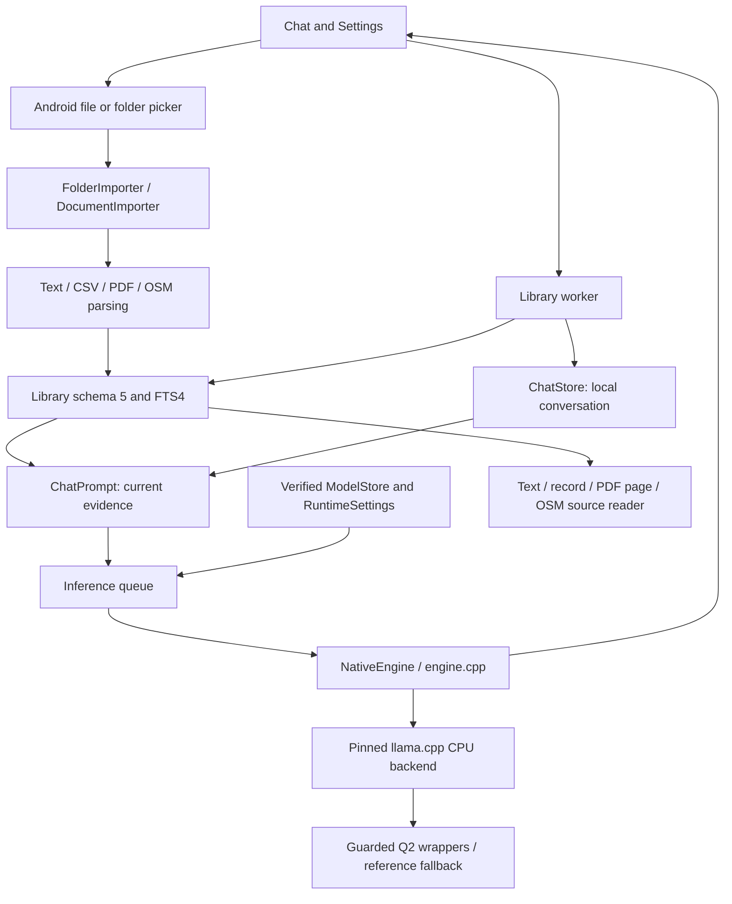

# Architecture

Implementation reference for **Outpost 0.13.0 / code 15**, checked on 2026-09-30. One Android process owns the UI, local databases and JNI inference session. There is no inference server or cloud fallback. Inference and knowledge are separate responsibilities within one application module, not separate Gradle modules.

## Current application flow

### Source map

Java files are under [app/src/main/java/dev/outpost/app](../app/src/main/java/dev/outpost/app); native files are under [app/src/main/cpp](../app/src/main/cpp).

| Component | Responsibility |
|---|---|
| `MainActivity` | Chat/Settings, pickers, document management, streaming, lifecycle, worker coordination |
| `ChatStore` / `ChatPrompt` | Private conversation persistence; bounded recent turns and current evidence |
| `FolderImporter` / `DocumentImporter` | Iterative SAF traversal, per-item outcomes, bounded staging/hash/parser selection, unchanged-file identity |
| `Library` / `Evidence` | Schema migration, source metadata/locators, documents/packs, lexical retrieval, resolution/removal |
| `CsvTable` / `KnowledgePack` | Literal CSV record parsing; bounded developer JSON pack contract |
| `PdfImporter` | Bounded page text extraction; the UI renders private originals with Android PdfRenderer |
| `OsmImporter` / `OsmStorage` | Bounded XML/JSON feature validation; separate feature rows, FTS entries and element resolution |
| `ModelStore` / `RuntimeSettings` | Locked generator imports; device/app-version/model-specific runtime policy |
| `NativeEngine` / `engine.cpp` | JNI, request IDs/cancellation, model/context lifecycle, sampling, cache and results |
| `cpu_caps.c` / `q2_dispatch.c` | CPU/OS detection separated from compiled/enabled implementation selection |
| `q2_kernel.c` / `q2_batch.c` | AVX2/F16C Q2 g64 dot and grouped matrix wrappers, guarded reference fallback |
| `speculation.cpp` | Research-only same-request proposals, verification helpers and cost controller |
| `ResearchPrompt`, `JudgeStore`, `EvidenceReview` | Evidence-only evaluation and optional Kev research; no reviewer/speculation product controls |
| `CMakeLists.txt` | Pinned unmodified backend, ABI configuration and linker wrappers |

### Direct place questions

`MainActivity` first calls synchronized `Library.answerPlaces`. `PlaceQueries` parses bounded named/category/radius intent, uses only prior user requests for short follow-ups, scans source features with row/character limits, detects global positive-ID conflicts, and computes spherical straight-line distances locally. It returns at most five source-backed results or explicit clarification/absence/constraint/limit outcomes. Identical records across extracts collapse for this answer only; original snapshots and locators remain unchanged. No schema or generator is needed for this path. Cancellation is checked during scans and complete answers/sources persist in the existing ChatStore.

### General chat request

1. Sending saves a pending turn and retrieves against the current message. `Library.search` bounds the query to 1,000 characters and 20 normalized terms, reads up to 500 FTS candidates and returns up to eight ranked fragments. It is lexical retrieval, not semantic or spatial ranking. Follow-up conversation is supplied to generation; there is no implemented history-based query rewrite.
2. `ChatPrompt` v1.1 includes the last two completed/length-limited turns (240 question and 400 answer characters each), up to three current excerpts of 600 characters, titles of 100 characters and the current question bounded to 600 characters. Excerpts are query-centered. Earlier numeric citations are stripped; failed/canceled/interrupted drafts are excluded.
3. The app saves the selected exact source locators and resolves the verified model/profile. No matching document permits general model knowledge with explicit instructions against invented personal/current facts. Research fixtures instead use `ResearchPrompt` and its evidence-only no-hit path.
4. The inference queue calls JNI with context 2,048 tokens, output limit 192 tokens and deadline 120 seconds. Product chat always sets speculation depth to zero. Character bounds do not guarantee token fit; native validation remains authoritative.
5. Confirmed text streams to the UI. The final turn retains its response, source references and completion/limit/cancel/error state. Numeric citation checks do not prove factual support.

The document reader is usable without a loaded generator. There is no separate product search screen; the library search API remains available to chat and tests. See [chat behavior](chat-beta.md).

## Data and transactions

`library.db` is schema 5; `chat.db` is schema 1. The library holds documents, FTS4 passages, versioned `knowledge_packs`, `imported_files` origin bindings and `osm_features`. [Knowledge contracts](knowledge-base.md) define exact hash/locator semantics and migration steps. Fresh product storage is empty. `TestLibrary` explicitly seeds isolated research databases from test-APK assets.

Single-file and folder imports are snapshots. URI identity + format + original-byte hash skips an unchanged extant import. Changed bytes create a new document; older snapshots remain searchable. Pack updates have a different contract: atomic activation, old versions excluded from ordinary search but retained for existing locators. Neither policy silently rebinds a saved citation.

Each folder file commits independently. Each OSM extract commits its document, feature rows, FTS and origin binding atomically; features are not concatenated into a giant document body. PDF and OSM originals live privately under `files/documents`. Filesystem copies and SQLite are not one crash-atomic transaction; comprehensive orphan cleanup remains pending.

## Concurrency and lifecycle

Library work and inference use separate single-thread executors. A folder import occupies the library worker, disables chat send and exposes progress; drafts remain editable. Import/model changes are gated against active generation. Provider calls and initial parser loading may delay cooperative cancellation.

Native sessions have a per-session lock; a global `execution_mutex` serializes graph execution because kernel settings are process-shared. Do not change worker kernel configuration during a graph. Backgrounding stops generation and queues cache release; Activity destruction also cancels folder work. Android low-memory state disables retaining context for that request. Database persistence and prompt KV reuse are distinct lifetimes. [Runtime](inference-runtime.md) owns the cache invariants.

## Extensions still proposed

The coordinator may eventually own editable mission context, typed arithmetic/units, structured applicability checks and a tool allowlist. ZIM and Office/OCR need their own adapters and evidence. The bounded OSM operations now resolve exact recorded names and category/proximity queries directly in chat; broader language, spatial indexes and polygon applicability remain future work; see [scope](osm-place-queries.md). Map rendering, navigation and routing are outside this feature. Named-reference queries do not require GPS. Stored coordinates do not supply the device's current position or prove polygon containment.

Discovery proposals for equipment transport, an action ledger and reflection-specific retention are not implemented. Source text/model output cannot authorize actions. Reconnection alone cannot authorize delivery. Future request categories such as `no_coverage`, `missing_context` and `unsupported_capability` are design ideas, not current public error enums. See [decisions](decisions.md), [discovery](discovery-2026-09-29.md) and [roadmap](roadmap.md).
