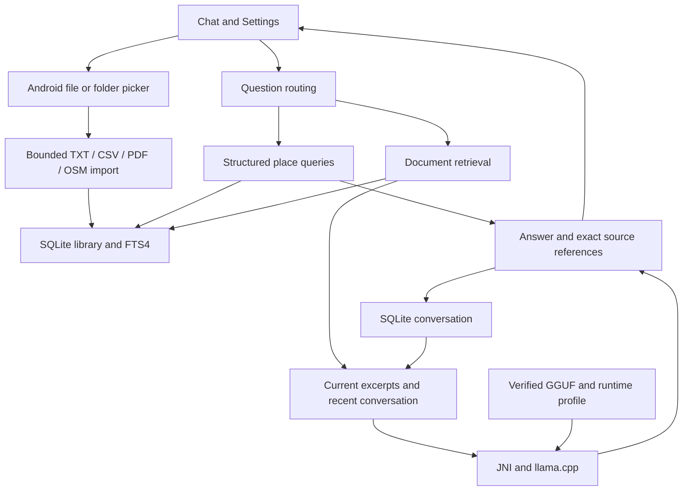

# Architecture

Outpost is one Android application with two independent responsibilities: **knowledge retrieval** and **local inference**. The UI, SQLite databases and native model session live in one process. Core operation has no Google Play Services dependency, inference server, cloud fallback or tool executor. Setup may download assets outside the app; inference, retrieval, indexing and source inspection then use local bytes.

## Components

Java sources are in [app/src/main/java/dev/outpost/app](../app/src/main/java/dev/outpost/app); native sources are in [app/src/main/cpp](../app/src/main/cpp).

| Component | Responsibility |
|---|---|
| `MainActivity` | Chat, Settings, document/model pickers, source readers, streaming and lifecycle |
| `ChatStore` / `ChatPrompt` | Persist turns; construct bounded conversation/evidence context |
| `DocumentImporter` / `FolderImporter` | Snapshot identity, limits, recursive SAF traversal, cancellation and per-item outcomes |
| `Library` / `Evidence` | SQLite migrations, FTS retrieval, documents/packs and immutable locators |
| `CsvTable` / `PdfImporter` | Literal CSV records and page-preserving PDF text extraction |
| `OsmImporter` / `OsmStorage` / `PlaceQueries` | Parse bounded extracts, store features and answer supported spatial questions |
| `ModelStore` / `RuntimeSettings` | Verify pinned files and select a device/OS/app/model-specific configuration |
| `NativeEngine` / `engine.cpp` | JNI, requests, cancellation, model/context lifecycle, sampling and cache |
| `cpu_caps.c` / `q2_dispatch.c` | CPU/OS capabilities and compiled/enabled kernel selection |
| `q2_kernel.c` / `q2_batch.c` / `q2_arm.c` | Guarded Q2 vector/matrix kernels and original reference fallback |
| `attention_probe.cpp` | Fixed attention-worker arithmetic and debug research probes |

`speculation.cpp`, `ResearchPrompt`, `JudgeStore` and `EvidenceReview` support research/evaluation. The product has no reviewer or speculation controls. Release excludes the Kev auxiliary assets and exports only the seven product JNI functions listed in [release.exports](../app/src/main/cpp/release.exports).

## Answer flow

For supported place questions, `Library.answerPlaces` uses named features, categories and a stated landmark/radius. It detects ambiguity/conflicting IDs, computes approximate straight-line distances, and returns at most five results with exact stored sources. This path works without a generator. It does not infer GPS position, live conditions, routing or polygon containment.

Other questions use lexical FTS retrieval. A no-hit search can retry with the preceding user question. `ChatPrompt` includes the last two completed or length-limited turns and up to three query-centered source excerpts. Failed, canceled and interrupted output is excluded from subsequent prompt history. Source text is framed as data, with role delimiters sanitized.

The app saves the pending turn and selected locators before generation. Verified model bytes and `RuntimeSettings.Profile.configuration(...)` supply the native request. Confirmed text streams to chat; the final answer, references and completion state are stored locally. With no matching source, the prompt permits general model knowledge but forbids invented personal records or current conditions. This instruction is not a correctness guarantee.

The current generation budget is a 2,048-token context, 192 output tokens and a 120-second deadline. Bonsai uses top-k 20, top-p 0.8, temperature 0.7 and seed 42; Qwen's product profile is greedy. Product speculation depth is zero.

## Storage and imports

| Store | Contents |
|---|---|
| `library.db`, schema 5 | Documents, FTS4 passages, import-origin bindings, versioned packs and OSM features |
| `chat.db`, schema 1 | Questions, answers, source locators and complete/limit/canceled/error/interrupted states |
| `files/documents` | Private PDF and OSM originals for source inspection |
| `files/models` | Imported GGUFs and verification markers |
| App preferences | Draft, selected model, import status and keyed runtime settings |

The product starts empty. Test providers and synthetic knowledge belong only to test APKs.

File/folder import identity combines source URI identity, format and original-byte hash. Unchanged extant imports are skipped; changed bytes create another snapshot, preserving older citations. Developer knowledge packs use a separate atomic activation contract: older pack versions stay resolvable but leave ordinary search. A locator binds a document, revision, source kind, ordinal and content hash; it must never silently rebind after removal or replacement.

Folder files commit independently and retain readable subfolder provenance. OSM document/features/FTS/origin rows commit atomically in SQLite, with features stored separately rather than in one oversized document body. Filesystem copies and database transactions are not jointly crash-atomic; complete orphan recovery remains open.

## Execution and cache invariants

Library operations and inference use separate single-thread executors. Import and model changes are gated against active generation. A folder import occupies the library worker and disables sending while allowing draft editing. Provider calls and parser startup can delay cooperative cancellation.

Native sessions have their own lock, plus a global `execution_mutex` because kernel settings are shared within the process. Configure kernels only under that execution boundary. Persistent pools pause between requests. Backgrounding cancels generation and queues cache release; destruction also cancels folder work. A low-memory request disables retaining its context.

Compatible token prefixes and saved prefix logits permit KV reuse. Model, template, context and kernel-policy changes must invalidate incompatible state. The 15-field `NativeEngine.Configuration` includes attention and matrix policy; do not reconstruct it through an older constructor and drop those fields.

The admitted Pixel/Bonsai 4B profile uses six decode/prefill workers, four logical attention workers, batch 128, width 8, prefill/decode row groups 1/4, prefill/decode chunks 32/0, persistent pools and no affinity. `attentionThreads=4` requires six/six workers and no speculation; `matrixKernel=1` additionally requires that attention policy and compiled, CPU-compatible I8MM. The exact fingerprint/capability guards are in [RuntimeSettings.java](../app/src/main/java/dev/outpost/app/RuntimeSettings.java); other profiles retain conservative settings.

ARM I8MM is for eligible multi-column prompt matrices; single-column work stays on DotProd. Q2_0 g64 stores 2.25 effective bits per weight including scales and uses prepared Q8 activations. Kernel lane grouping and accumulation order preserve the admitted reference arithmetic. KV storage remains F16. The fixed-attention wrapper depends on the pinned backend's barrier/scratch contract; changing that backend requires a new numerical and concurrency audit.

## Resource envelope

The deployment target is an Android/GrapheneOS device with no more than 12 GB of installed RAM and a complete offline footprint no larger than 50 GB. Count the app, models, original files, indexes, databases, temporary import copies and any other local assets. Small GGUF download sizes alone do not establish either limit: the live model, KV cache, activation workspace, parsers and operating system also consume resources.

Per-file import limits and guarded kernels already exist; a global storage cap and constrained physical-device acceptance do not. The current Pixel measurements come from a 16 GB device. Keep allocation/cache policy and import storage accounting separate from claims of meeting the target; [testing](testing.md) defines the required measurements.

## Boundaries and extension points

The product manifest requests no permissions and disables backup. Imports create private copies. Sources cannot execute code, invoke device tools or authorize external actions. No telemetry, account, downloader or synchronization service is present.

Add knowledge adapters through bounded parsing, explicit source identity and resolvable citations. Add models through reviewed pins/templates/runtime admission. Add kernels behind independent CPU, compiled-availability, shape and numerical gates. OCR, Office/ZIM, trained MTP/Engram, broader device tuning and equipment actions are unimplemented. Remaining acceptance work is summarized in [testing](testing.md).
