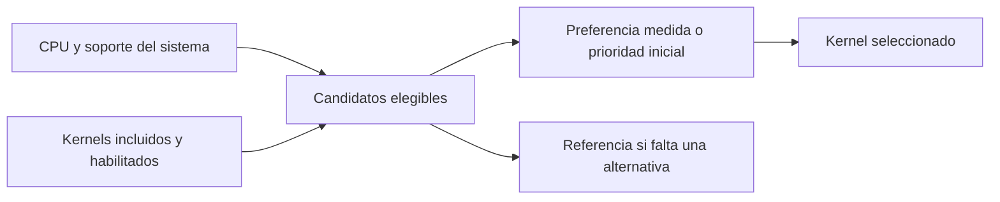

# Selección de cálculo según el dispositivo · 0.5.1

> Historical record: observations, proposals and commands below describe the recorded release/session. For Outpost 0.12 use [current state](current-state.md), [handoff](handoff.md) and [current validation](validation-0.12.md). Original results and language are preserved.

Evolución posterior: [0.6 incorpora perfiles medidos, agrupación del prefill y caché con liberación de contexto](validation-0.6.md). Los requisitos de CPU y la distinción entre candidato e implementación de esta nota siguen vigentes. Las referencias de resultados históricos describen 0.5.1; los registros operativos pueden incluir comprobaciones posteriores.

El motor debe trabajar con capacidades comprobadas en ejecución y con implementaciones incluidas en cada compilación. El nombre comercial del teléfono no decide qué instrucciones se ejecutan. La configuración que resulta rápida en un emulador x86 no se considera óptima para un teléfono ARM.

## CPU, implementación y elección son cosas distintas

VNNI corresponde a x86. En ARM64, las variantes relevantes para este trabajo incluyen NEON, DotProd e I8MM, que son extensiones distintas. AVX-VNNI y AVX-512 VNNI también tienen requisitos diferentes: la segunda requiere soporte del sistema operativo para conservar estado adicional. Referencias: [Intel VNNI](https://www.intel.com/content/www/us/en/developer/articles/guide/deep-learning-with-avx512-and-dl-boost.html), [intrinsics de Arm](https://arm-software.github.io/acle/neon_intrinsics/advsimd.html), [detección de capacidades con Android NDK](https://developer.android.com/ndk/guides/cpu-features).

La nueva capa propia se divide en:

- [cpu_caps.c](../app/src/main/cpp/cpu_caps.c): detección de ABI, capacidades y número de CPU lógicas. En x86 usa CPUID y XCR0; en ARM64 consulta `getauxval(AT_HWCAP/AT_HWCAP2)`. XGETBV se ejecuta únicamente después de comprobar XSAVE/OSXSAVE. Se diferencia I8MM de NEON de SVE I8MM.
- [q2_dispatch.c](../app/src/main/cpp/q2_dispatch.c): requisitos de candidatos Q2_0 g64 × Q8_0 y selección entre los compatibles, compilados y habilitados. Admite una preferencia de rendimiento ya medida, pero esa preferencia nunca permite saltarse requisitos. La prioridad por defecto no es una afirmación de que una ISA sea siempre más rápida.
- [q2_kernel.c](../app/src/main/cpp/q2_kernel.c): implementaciones realmente disponibles y llamada al kernel original como respaldo. El registro de requisitos de una variante futura no añade su implementación ni permite ejecutarla.



El perfil JSON expone por candidato `cpuCompatible`, `compiled`, `enabled` y `selected`. Estado distingue capacidades compatibles y ruta activa, e indica kernel pendiente si el hardware permitiría una variante ausente del binario. No se debe marcar una variante como habilitada hasta superar sus pruebas de corrección. La arquitectura mantiene disponible la referencia.

## Escenarios

| Escenario | Política prevista | Estado real en 0.5.1 |
|---|---|---|
| x86_64 sin AVX2/F16C o sin estado YMM del sistema | Referencia | Implementado; selección y fallback forzado probados |
| x86_64 con AVX2/F16C | Kernel AVX2 | Implementado y ejecutado en el emulador |
| x86 con AVX-VNNI | Considerar kernel AVX-VNNI, compararlo con AVX2 | Detección/requisitos probados con perfiles sintéticos; kernel pendiente |
| x86 con AVX-512 VNNI | Comprobar extensiones requeridas y estado ZMM/opmask; comparar rendimiento | Detección/requisitos probados con perfiles sintéticos; kernel pendiente |
| ARM64 con NEON | Referencia y candidato NEON | Módulos propios compilados como objetos ARM64; kernel propio y APK ARM pendientes |
| ARM64 con DotProd | Considerar candidato SDOT | Detección/requisitos probados con perfiles sintéticos; kernel pendiente |
| ARM64 con I8MM | Considerar candidato matricial según la operación | Detección/requisitos probados con perfiles sintéticos; kernel pendiente |

Concretamente, un dispositivo x86 con VNNI que ejecute **este** APK seguirá usando AVX2 si satisface sus requisitos: aún no hay un kernel VNNI incluido. La capacidad adicional se detecta, pero no se presenta como una aceleración implementada. El APK distribuido sigue siendo solo x86_64 para emulador; estos cambios no lo convierten en una aplicación lista para los Pixel.

La compilación cruzada de tres módulos C para ARM64 comprueba portabilidad de esos archivos. No comprueba el enlace de todo el motor ARM, la instalación de un APK ARM ni su ejecución. No se utilizaron teléfonos físicos.

## Recursos y tipo de trabajo: siguiente capa

Una CPU compatible no determina cuánta RAM se puede dedicar al modelo ni garantiza mayor velocidad. La política completa también debe incorporar, mediante mediciones:

1. **Operación y formato:** prefill frente a generación, número de tokens, dimensiones y cuantización exacta. Una variante para multiplicaciones matriciales puede ser útil al leer el prompt y no ganar al generar un token. El registro actual se limita a Q2_0 g64 × Q8_0.
2. **Memoria disponible:** pesos, KV, buffers de trabajo y margen para Android. Definir presupuestos de contexto/caché antes de asignar; no equiparar RAM anunciada con RAM libre para la app. Si no cabe 4B, explicar la limitación y mantener búsqueda/lectura disponibles; un modelo menor debe ser una elección visible.
3. **Hilos y estado del dispositivo:** medir prefill y generación por separado, considerar núcleos heterogéneos, temperatura y ahorro energético. La cantidad de CPU lógicas detectada no es una recomendación de usar todos los hilos.
4. **Backend:** una GPU o NPU solo es candidata si el runtime soporta el grafo y formato utilizados y sus costes de conversión/copia compensan. No se presupone que cualquier acelerador ejecute el GGUF de Bonsai.

Guardar una calibración requiere identificar ABI/capacidades, motor, modelo, formato y parámetros de trabajo. Invalidarla cuando cambien. Hacer ajustes en límites seguros entre consultas; no cambiar el estado matemático de una inferencia en curso. Estas políticas no estaban implementadas en 0.5.1. En 0.6 los hilos/lotes son configurables y el perfil medido se guarda con identidad de dispositivo y modelo; el contexto sigue limitado a 2048. La adaptación térmica y los presupuestos completos de memoria siguen pendientes.

## Comprobación reproducible

- [64 comprobaciones de selección](../evidence/0.7-before-outpost/optimization/kernel-dispatch.json) ejecutadas dentro del emulador: perfiles AVX2, AVX-VNNI, AVX-512 VNNI, NEON, DotProd, I8MM y arquitectura desconocida; ausencia de requisitos individuales; instrucciones anunciadas sin soporte del sistema; código ausente/deshabilitado; preferencia incompatible; respaldo y restauración. **Los perfiles sintéticos no ejecutan instrucciones VNNI ni ARM.**
- [Compilación de seis objetos](../evidence/0.7-before-outpost/optimization/portability.json): `cpu_caps.c`, `q2_dispatch.c` y `q2_kernel.c` para Android x86_64 y ARM64 con NDK r28b, `-Wall -Wextra -Werror`. Solo compilación, sin ejecutar esos objetos en el host.
- [Paridad numérica del kernel activo](../evidence/0.7-before-outpost/optimization/kernel-numeric.json): 16.241 vectores sin diferencias de bits, dispatch real y páginas protegidas. Los números históricos de 0.5 se conservan [aparte](../evidence/0.7-before-outpost/0.5/kernel-numeric.json).
- [Comparación real de Bonsai 4B](../evidence/0.7-before-outpost/optimization/kernel-decoder4.json) con referencia y AVX2, [comprobaciones funcionales](../evidence/0.7-before-outpost/checks.json) y [Estado](../evidence/0.7-before-outpost/models.png).

La compilación y Android Lint terminaron sin incidencias. Pasaron las 48 comprobaciones funcionales y la generación visible con Bonsai 4B. La comparación breve conservó exactamente los mismos 10 tokens con ambas rutas (33,39 s referencia / 6,21 s AVX2, una pareja con cargas/cachés distintas). La consulta visible terminó en 36,56 s, primer token a 20,65 s. Son controles de regresión; no se atribuye una nueva aceleración a esta refactorización, que conserva la aritmética anterior. Bonsai 4B sigue seleccionado, modo avión activado y Wi-Fi apagado.

[APK 0.5.1 para emulador x86_64](../dist/brujula-0.5.1-emulator-debug.apk) · [SHA-256](../dist/brujula-0.5.1-emulator-debug.apk.sha256).

```powershell
pwsh -File scripts/check-native-portability.ps1
pwsh -File scripts/build.ps1 -Offline
pwsh -File scripts/test-kernel.ps1 -Phase dispatch
pwsh -File scripts/test-kernel.ps1 -Phase numeric
pwsh -File scripts/test-kernel.ps1 -Phase decoder4
pwsh -File scripts/test-emulator.ps1
pwsh -File scripts/test-bonsai.ps1 -UiOnly -UiProfile bonsai4 -SkipInstall -KeepSelected
```

Los controles de rendimiento conservan entradas cortas conocidas. La calibración de producto debe incluir las [misiones de campo](field-use-cases.md), con presupuesto de espera y memoria, además de calidad de respuesta.
