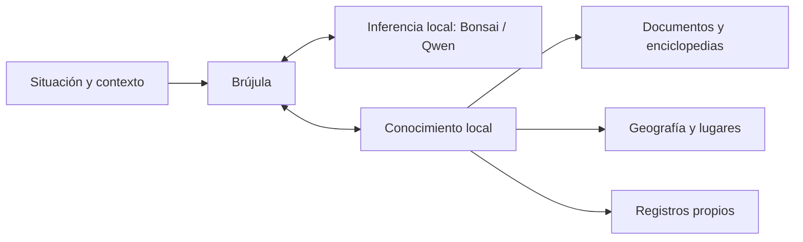

# Dos dominios: inferencia y conocimiento local

> Historical record: observations, proposals and commands below describe the recorded release/session. For Outpost 0.12 use [current state](current-state.md), [handoff](handoff.md) and [current validation](validation-0.12.md). Original results and language are preserved.

Estado: propuesta de arquitectura para discutir y desarrollar. No añade integraciones ni cambia el APK 0.4. Conserva los cinco [casos de uso en el terreno](field-use-cases.md) y la restricción de ejecutar las pruebas en el emulador.

## Principio

La inferencia comprende la consulta, interpreta evidencia y explica. La base de conocimiento conserva y recupera información consultable. La aplicación coordina ambas a través de un contrato estable, con contexto y herramientas locales.

Un cambio de generador no debería obligar a volver a importar documentos o mapas. Añadir una fuente no debería requerir entrenar o sustituir el generador. La búsqueda y lectura deben seguir siendo útiles sin un modelo cargado.



## A. Inferencia

Responsabilidades:

- Interpretar la intención y detectar datos que faltan.
- Formular consultas acotadas a las capacidades que la aplicación ofrece.
- Explicar, comparar y sintetizar a partir de evidencia, manteniendo visibles los supuestos.
- Ofrecer capacidades opcionales de embeddings, clasificación o visión mediante modelos apropiados para cada tarea. No se supone que cualquier LLM produzca embeddings útiles ni que el revisor pueda certificar hechos.
- Administrar carga/descarga de pesos, presupuesto de contexto, cancelación, caché y límites de tiempo/memoria.

Bonsai y Qwen son perfiles intercambiables. «Super eficiente» será un objetivo medido: calidad sobre las misiones, tiempo hasta información útil, evaluación del prompt, decodificación y memoria. Las pruebas actuales muestran que menos bytes de pesos no garantizan menor latencia en nuestro backend. Consumo energético y comportamiento térmico real no se pueden inferir de las medidas del emulador.

Empezaría con un generador residente a la vez. Un segundo modelo —embeddings o revisor— solo se justifica si su mejora compensa carga, RAM y tiempo. Leer un registro, calcular una distancia o convertir una unidad no tiene por qué disparar generación de texto.

Contrato propuesto: recibir consulta, contexto confirmado, evidencia identificada y presupuesto; devolver texto progresivo, referencias a esos identificadores, preguntas de aclaración o solicitudes a herramientas locales permitidas. Las referencias se resuelven contra la evidencia entregada, no contra enlaces inventados.

## B. Base de conocimiento

Es una colección de fuentes con adaptadores, índices y procedencia. No un único archivo ni una base vectorial que deba contener todo.

### Preparación e incorporación

1. Importar o preparar el paquete antes de necesitarlo sin cobertura.
2. Conservar el original y registrar procedencia, versión, idioma, ámbito y permisos de uso.
3. Extraer texto, estructura o entidades; conservar páginas, tablas, unidades y localizadores del original.
4. Construir los índices necesarios y comprobar su compatibilidad/versiones.
5. Hacer visible qué cubre el paquete y qué no; actualizarlo o sustituirlo sin afectar a los demás.

PDF escaneado y PDF con texto requieren tratamientos distintos. La extracción/OCR puede equivocarse; conservar la página visible es necesario para inspeccionar números, diagramas o tablas. TXT/Markdown ya están soportados; el resto de adaptadores está pendiente.

### Almacenamiento y recuperación adecuados a cada fuente

| Fuente | Representación candidata | Consulta útil |
|---|---|---|
| Wikipedia, Wikivoyage y bibliotecas empaquetadas | Archivo comprimido ZIM con adaptador de lectura/búsqueda; contenido por idioma o selección temática | Artículo, sección, búsqueda por título/texto y recuperación de pasajes. |
| Manuales, guías, reservas y documentación propia | Original, estructura extraída e índice por documento/sección/página | Procedimiento de un equipo exacto, condición de una reserva, tabla o concepto. |
| OpenStreetMap y otros datos geográficos | Entidades y geometrías indexadas; capas de visualización y grafo de rutas como capacidades distintas | Lugar cercano, filtro por atributos, elemento del mapa, ruta según el grafo disponible. |
| Registros de campo y lecturas del usuario | Datos estructurados con fecha, unidad, entidad y origen | Historial de un activo, comparación de lecturas y cálculos locales. |

La búsqueda puede combinar palabras, filtros por entidad/revisión, proximidad geográfica y recuperación semántica. Las distancias y rutas deben resolverse con geometría/grafo, y los códigos exactos de una máquina con coincidencias y filtros, antes de pedir al generador que los explique.

No es necesario convertir una enciclopedia entera en embeddings para empezar. Cuando se añada un índice vectorial, debe declarar el encoder y su versión/dimensión. Cambiar ese encoder exige revisar o reconstruir ese índice; cambiar solo el generador no.

### Tres niveles de conocimiento

- **Base general:** contenido de referencia que siempre acompaña a la app.
- **Paquetes de zona/actividad:** cartografía, guías y materiales para el viaje o trabajo previsto.
- **Información propia:** manuales de equipos concretos, reservas, planos y observaciones aportadas.

Esas capas permiten servir a los cinco contextos con el mismo sistema. Se selecciona qué llevar sin exigir instalar todo el mundo ni todos los oficios.

## Fuentes comprobadas y límites de integración

### Wikipedia / Kiwix / ZIM

[Kiwix para Android](https://github.com/kiwix/kiwix-android) lee archivos ZIM comprimidos; [libzim](https://github.com/openzim/libzim) proporciona lectura y búsqueda cuando se compila con sus dependencias correspondientes. Es una vía a investigar para consultar paquetes existentes sin duplicar todo su contenido en nuestra base. No se ha integrado aún en Brújula. Un ZIM concreto debe comprobarse por contenido, idioma, índice y tamaño; no se presupone que cualquier edición completa quepa junto a los demás recursos.

### OpenStreetMap

Los [extractos geográficos de Geofabrik](https://download.geofabrik.de/) son una fuente candidata para preparar regiones. Hay que diferenciar los datos OSM de un servicio de imágenes de mapa: la [política del servidor estándar de teselas](https://operations.osmfoundation.org/policies/tiles/) prohíbe descargas masivas para uso offline. La propuesta es trabajar con extractos y paquetes/proveedores que permitan ese uso, conservando las [atribuciones y condiciones de OSM](https://www.openstreetmap.org/copyright). Disponer de un mapa dibujado no demuestra que haya POI consultables, elevación o un grafo de navegación.

### Google Maps offline

[Google documenta mapas descargados para su propia aplicación](https://support.google.com/maps/answer/6291838?hl=es). Eso no establece una interfaz para que Brújula lea o indexe esa caché. No se encontró en las referencias consultadas una vía pública soportada para importar esos paquetes.

El [Navigation SDK de Android declara que no ofrece un modo offline completo](https://developers.google.com/maps/documentation/navigation/android-sdk/faq), aunque precarga información de un trayecto. Las [políticas de Places](https://developers.google.com/maps/documentation/places/web-service/policies) también limitan el almacenamiento de contenido con excepciones concretas. No se considera Google Maps una fuente local intercambiable con OSM en esta propuesta. Puede estudiarse una apertura opcional en la app externa, sin convertirla en dependencia del núcleo ni prometer acceso a sus mapas o fichas descargadas.

## Contrato entre dominios

La KB debería devolver un resultado tipado y pequeño, por ejemplo:

```text
Evidence:
  id y tipo (pasaje, lugar, tabla, ruta, registro)
  contenido o campos estructurados
  referencia al original (paquete/documento/página/sección/entidad)
  versión, fechas e idioma
  contexto aplicable (zona, activo/modelo, unidades)
  limitaciones: falta de cobertura, dato ausente, extracción dudosa o conflicto
```

La aplicación selecciona un conjunto acotado de evidencia para la tarea y el presupuesto del modelo. El orden de resultados es una estimación de relevancia, no una garantía de verdad. Conflictos y fechas no desaparecen al formar el prompt. El texto de las fuentes se trata como datos, nunca como autorización para ejecutar instrucciones.

Ejemplo: una persona describe una caída de presión. La aplicación conoce el equipo confirmado; la KB recupera su manual y las lecturas aportadas; una herramienta calcula lo necesario con unidades explícitas; el modelo organiza hipótesis y pide la observación que falta. La misma inferencia podría ayudar a un viajero al recibir evidencia geográfica y una reserva en lugar de ese manual.

## Preparar frente a utilizar

La preparación de paquetes, pesos e índices puede requerir conectividad previa. La consulta en el terreno debe arrancar y funcionar sin ella. La arquitectura no presupone que el teléfono pueda actualizar datos una vez aislado ni que una instalación inicial haya guardado todos los recursos necesarios.

Un manifiesto de paquete debería declarar identificador, versión, tamaño, hashes, idioma, alcance geográfico/temático, fecha del contenido, procedencia/licencia y capacidades (lectura, texto, entidades, rutas, etc.). El gestor debe contar pesos, fuentes, índices, documentos y espacio temporal de instalación/actualización dentro de su presupuesto. La referencia del concurso sigue siendo 50 GB totales y un entorno de 12 GB; las pruebas actuales continúan en el emulador de 4 GiB.

## Evaluaciones independientes y combinadas

| Área | Mantener fijo | Medir |
|---|---|---|
| Inferencia | Evidencia correcta y suficiente | Comprensión, uso de fuentes, respuesta, latencia, memoria y cancelación. |
| Knowledge base | Consulta y registros relevantes conocidos | Cobertura, precisión de recuperación, procedencia, tiempo de búsqueda y tamaño de índices. |
| Integración | Misión de uno de los cinco contextos | Datos que se pidieron, herramientas usadas, evidencia seleccionada y resolución de la tarea. |

Así se distingue si falló la información disponible, la recuperación, el contexto enviado o la interpretación del modelo. Una evaluación global única no permite localizar el problema.

## Siguiente decisión de implementación

Definir primero ese contrato y un manifiesto mínimo, conectando la biblioteca de texto existente y un segundo tipo de fuente. Los primeros adaptadores candidatos son documentos con páginas y un paquete enciclopédico ZIM; después, un paquete geográfico con entidades consultables. Probar cada adaptador en las misiones relevantes sin modificar el motor por cada fuente. La elección de librerías y formatos definitivos requiere un pequeño prototipo y mediciones en el emulador.

Esta separación es una organización de módulos dentro de la aplicación. La coordinación y la experiencia de campo siguen siendo compartidas. No se han instalado conectores, descargado fuentes nuevas ni ejecutado modelos durante esta fase de diseño.
